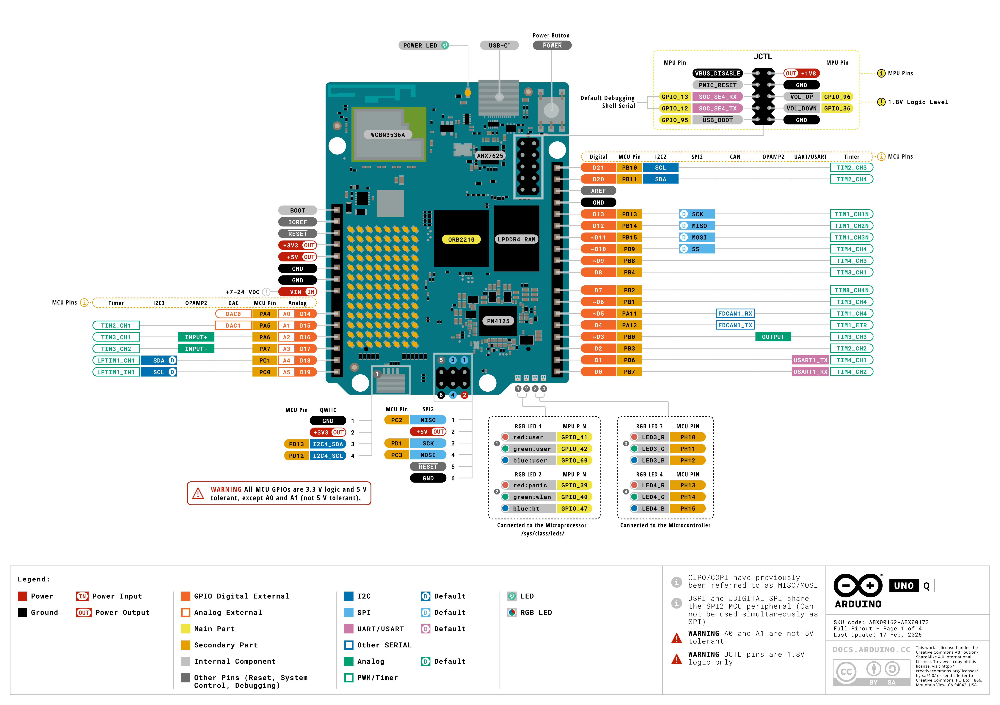

# Capítulo 4. Entradas y salidas digitales

## Objetivos de aprendizaje

Al finalizar este capítulo, el alumnado será capaz de:

- Identificar los conectores digitales de Arduino UNO Q en el pinout oficial.
- Distinguir una entrada digital de una salida digital y los estados `HIGH` y `LOW`.
- Montar circuitos sencillos en una protoboard sin provocar cortocircuitos.
- Calcular y colocar una resistencia limitadora de corriente para un LED.
- Configurar GPIO mediante `pinMode()`, `digitalWrite()` y `digitalRead()`.
- Utilizar `INPUT_PULLUP` para leer pulsadores sin resistencias externas.
- Reconocer el rebote mecánico de un pulsador y aplicar un antirrebote sencillo.
- Comprobar y documentar el funcionamiento de un montaje físico.

## 1. Introducción

En el capítulo anterior utilizamos los LED RGB integrados en Arduino UNO Q. Ahora conectaremos componentes externos al microcontrolador **STM32U585**, utilizando las entradas y salidas digitales disponibles en los conectores de la placa.

Un pin digital puede configurarse para **enviar una señal** a un circuito (salida) o **leer su estado** (entrada). En estas primeras prácticas emplearemos una protoboard, LED, resistencias y pulsadores.

!!! warning "Seguridad eléctrica de Arduino UNO Q"

    Los GPIO del STM32 utilizan **lógica de 3,3 V**. Según el pinout oficial de Arduino UNO Q, muchos son tolerantes a señales de entrada de 5 V, **excepto A0 y A1**. Esto **no significa** que una salida GPIO proporcione 5 V ni que pueda alimentar cargas de potencia.

    Trabajaremos con **3,3 V**, resistencias limitadoras y componentes de bajo consumo. Nunca conectes directamente un motor, relé o carga de potencia a un GPIO. No conectes directamente 5 V a A0 o A1.

    Los pines del conector **JCTL** pertenecen al procesador Linux y utilizan lógica de **1,8 V**: no los utilizaremos en estas prácticas.

### 1.1. Material necesario

Por cada pareja de alumnos:

- Una placa Arduino UNO Q y su cable de conexión.
- Un ordenador con Arduino App Lab configurado.
- Una protoboard.
- Dos LED de colores diferentes.
- Dos resistencias de **220 Ω** (o **330 Ω**).
- Un pulsador de cuatro terminales.
- Cables de conexión para protoboard.
- El pinout oficial de Arduino UNO Q.

## 2. Identificación de los pines digitales

En el conector digital de Arduino UNO Q encontramos pines identificados como **D0, D1, D2, ...**. También existen pines con funciones alternativas, como comunicación serie, PWM y buses de comunicación.

Para estas prácticas utilizaremos los siguientes pines:

| Pin | Función en este capítulo | Uso |
|---|---|---|
| **D8** | Salida digital | LED externo |
| **D2** | Entrada digital | Pulsador |
| **D3** | Salida digital | Segundo LED |
| **GND** | Referencia eléctrica | Retorno común |
| **3V3** | Alimentación de 3,3 V | Solo cuando el circuito lo requiera |

Los pines D2, D3 y D8 están identificados en el pinout oficial de Arduino UNO Q. La numeración debe verificarse visualmente en la placa antes de realizar conexiones.



*Figura 4.1. Pinout oficial de Arduino UNO Q. Fuente: Arduino, documento ABX00162-ABX00173 (17 de febrero de 2026), licencia CC BY-SA 4.0.*

!!! tip "Antes de cablear"

    Desconecta la alimentación de la placa. Localiza el nombre impreso de cada pin y comprueba la continuidad de las filas de la protoboard. Conecta el cable USB solo cuando hayas revisado el circuito.

## 3. Salidas digitales: controlar un LED externo

Una salida digital establece uno de dos niveles lógicos:

- `HIGH`: nivel lógico alto (aproximadamente 3,3 V en estos GPIO).
- `LOW`: nivel lógico bajo (aproximadamente 0 V).

Cuando conectamos un LED externo con su ánodo hacia la salida digital y su cátodo hacia GND, normalmente **`HIGH` lo enciende y `LOW` lo apaga**. Este comportamiento es distinto al de los LED RGB integrados que utilizamos en el capítulo 3.

### 3.1. ¿Por qué necesitamos una resistencia?

Un LED no debe conectarse directamente entre un GPIO y GND. Es necesario limitar la corriente mediante una resistencia **en serie**.

Una estimación de la resistencia mínima puede obtenerse con la ley de Ohm:

\[
R = \frac{V_{GPIO} - V_{LED}}{I}
\]

Para un LED rojo típico, con una caída aproximada de 2 V, y una corriente de diseño de 5 mA:

\[
R = \frac{3,3 - 2}{0,005} = 260\ \Omega
\]

Una resistencia comercial de **330 Ω** permite una corriente aproximada de 3,9 mA; una de **220 Ω**, unos 5,9 mA. Estos valores son orientativos: dependen del LED real y siempre deben respetarse los límites de corriente del GPIO indicados en la documentación eléctrica de la placa.

### 3.2. Identificación de las patillas del LED

- **Ánodo (+):** normalmente la patilla más larga.
- **Cátodo (−):** normalmente la patilla más corta y el lado plano de la cápsula.

Si las patillas están recortadas, utiliza la marca plana del encapsulado o comprueba el componente con un multímetro.

### 3.3. Conexiones del circuito

Con la placa desconectada:

1. Inserta el LED en la protoboard con las dos patillas en filas distintas.
2. Conecta el pin **D8** a una resistencia de **330 Ω**.
3. Conecta el otro extremo de la resistencia al **ánodo** del LED.
4. Conecta el **cátodo** del LED al pin **GND** de Arduino UNO Q.
5. Revisa que no existan cortocircuitos y conecta la placa.

**Esquema lógico:**

```text
Arduino UNO Q

D8 ───── [330 Ω] ───── |>| ───── GND
                       LED
                  ánodo → cátodo
```

La resistencia puede situarse antes o después del LED, siempre que esté **en serie**.

### 3.4. Programa 1. Encendido y apagado

Crea una aplicación en Arduino App Lab llamada `cap04_01_led_externo` y escribe el siguiente código en su sketch:

```cpp
#include <Arduino.h>

const int PIN_LED = D8;

void setup()
{
    pinMode(PIN_LED, OUTPUT);
    digitalWrite(PIN_LED, LOW);
}

void loop()
{
    digitalWrite(PIN_LED, HIGH);  // Encender
    delay(1000);

    digitalWrite(PIN_LED, LOW);   // Apagar
    delay(1000);
}
```

**Comprobación:** el LED permanece un segundo encendido y otro apagado, repitiendo el ciclo.

!!! example "Actividad 4.1. Modificar el parpadeo"

    Modifica el programa para que el LED permanezca **200 ms encendido** y **800 ms apagado**. Calcula cuántos ciclos completos realiza aproximadamente en un minuto.

## 4. Entradas digitales: leer un pulsador

Una entrada digital permite detectar si en un pin existe un nivel lógico alto o bajo. Para leer su estado utilizamos:

```cpp
int estado = digitalRead(D2);
```

La variable `estado` contendrá `HIGH` o `LOW`.

### 4.1. El problema de las entradas flotantes

Si configuramos una entrada con `INPUT` y no establecemos un nivel eléctrico definido, el pin puede leer valores impredecibles debido al ruido eléctrico.

Para evitarlo podemos utilizar una resistencia de *pull-up* o *pull-down*. Arduino ofrece una resistencia *pull-up* interna que se activa con:

```cpp
pinMode(D2, INPUT_PULLUP);
```

Con esta configuración:

| Estado del pulsador | Lectura en D2 |
|---|---|
| Sin pulsar | `HIGH` |
| Pulsado | `LOW` |

Es decir, la entrada es **activa a nivel bajo**.

### 4.2. Conectar un pulsador de cuatro terminales

Los pulsadores habituales de cuatro patas tienen **dos parejas de terminales unidas internamente**. Al presionar, se conectan ambas parejas.

Antes de montarlo, identifica las parejas con un multímetro o el esquema del fabricante. Si lo colocas atravesando la ranura central de la protoboard, suele resultar más sencillo separar las conexiones, pero verifica igualmente la orientación.

**Conexiones:**

1. Desconecta Arduino UNO Q.
2. Inserta el pulsador en la protoboard.
3. Conecta un terminal de una pareja al pin **D2**.
4. Conecta un terminal de la pareja opuesta a **GND**.
5. Mantén el LED externo conectado a D8 como en el apartado anterior.
6. Comprueba el montaje y conecta la placa.

```text
D2 ───── [ PULSADOR ] ───── GND
          normalmente
            abierto

D8 ───── [330 Ω] ───── |>| ───── GND
```

!!! warning "No conectar el pulsador entre 3V3 y GND"

    En esta práctica el pulsador une **D2 con GND**, no la alimentación de 3,3 V con GND. La resistencia *pull-up* interna mantiene la entrada a nivel alto cuando el pulsador está abierto.

### 4.3. Programa 2. Encender el LED al pulsar

Crea `cap04_02_pulsador_led`:

```cpp
#include <Arduino.h>

const int PIN_LED = D8;
const int PIN_PULSADOR = D2;

void setup()
{
    pinMode(PIN_LED, OUTPUT);
    pinMode(PIN_PULSADOR, INPUT_PULLUP);

    digitalWrite(PIN_LED, LOW);
}

void loop()
{
    int estado = digitalRead(PIN_PULSADOR);

    if (estado == LOW)
    {
        digitalWrite(PIN_LED, HIGH); // Pulsado
    }
    else
    {
        digitalWrite(PIN_LED, LOW);  // Liberado
    }
}
```

**Resultado esperado:** el LED se enciende mientras se mantiene pulsado el botón y se apaga al soltarlo.

### 4.4. La estructura condicional `if / else`

La estructura `if` permite ejecutar unas instrucciones cuando se cumple una condición y otras cuando no se cumple:

```cpp
if (condicion)
{
    // Se ejecuta cuando la condición es verdadera
}
else
{
    // Se ejecuta cuando es falsa
}
```

En nuestro programa, la condición `estado == LOW` indica que el pulsador está presionado. Observa que `==` **compara** valores, mientras que `=` **asigna** un valor.

!!! example "Actividad 4.2. Invertir el comportamiento"

    Modifica el programa para que el LED esté **encendido mientras no se pulsa** y **apagado mientras se pulsa**. Explica por qué `INPUT_PULLUP` invierte la interpretación habitual del botón.

## 5. Monitorización de una entrada digital

Podemos enviar mensajes de diagnóstico a la consola del sketch. Para evitar inundarla, mostraremos un mensaje únicamente cuando cambie el estado del pulsador.

### Programa 3. Detectar cambios de estado

Crea `cap04_03_estado_pulsador`:

```cpp
#include <Arduino.h>

const int PIN_PULSADOR = D2;
int estadoAnterior = HIGH;

void setup()
{
    pinMode(PIN_PULSADOR, INPUT_PULLUP);
    Serial.begin(9600);
    Serial.println("Lectura del pulsador iniciada");
}

void loop()
{
    int estadoActual = digitalRead(PIN_PULSADOR);

    if (estadoActual != estadoAnterior)
    {
        if (estadoActual == LOW)
        {
            Serial.println("Pulsador presionado");
        }
        else
        {
            Serial.println("Pulsador liberado");
        }

        estadoAnterior = estadoActual;
    }

    delay(20);
}
```

Abre la consola correspondiente al **sketch del microcontrolador** en Arduino App Lab. Comprueba que se muestran los mensajes al pulsar y liberar el botón.

!!! info "Observación"

    El retardo de 20 ms reduce la frecuencia de lectura, pero **no garantiza** la eliminación del rebote mecánico. En el siguiente apartado implementaremos una técnica de antirrebote más controlada.

## 6. Rebote mecánico y antirrebote

Los contactos físicos de un pulsador pueden abrirse y cerrarse varias veces durante unos milisegundos antes de estabilizarse. Este fenómeno se denomina **rebote** (*bounce*).

Si queremos que cada pulsación cambie el estado de un LED una sola vez, debemos detectar una transición estable del pulsador.

### Programa 4. Pulsador como interruptor con antirrebote

Crea `cap04_04_interruptor_antirrebote`:

```cpp
#include <Arduino.h>

const int PIN_LED = D8;
const int PIN_PULSADOR = D2;
const unsigned long TIEMPO_REBOTE = 40;

bool ledEncendido = false;
int lecturaAnterior = HIGH;
int estadoEstable = HIGH;
unsigned long ultimoCambio = 0;

void setup()
{
    pinMode(PIN_LED, OUTPUT);
    pinMode(PIN_PULSADOR, INPUT_PULLUP);
    digitalWrite(PIN_LED, LOW);
    Serial.begin(9600);
}

void loop()
{
    int lectura = digitalRead(PIN_PULSADOR);

    if (lectura != lecturaAnterior)
    {
        ultimoCambio = millis();
    }

    if (millis() - ultimoCambio >= TIEMPO_REBOTE)
    {
        if (lectura != estadoEstable)
        {
            estadoEstable = lectura;

            // Actuar solamente al presionar, no al soltar
            if (estadoEstable == LOW)
            {
                ledEncendido = !ledEncendido;
                digitalWrite(PIN_LED, ledEncendido ? HIGH : LOW);
                Serial.println(ledEncendido ? "LED ON" : "LED OFF");
            }
        }
    }

    lecturaAnterior = lectura;
}
```

### 6.1. Nuevos elementos del lenguaje

| Elemento | Significado |
|---|---|
| `bool` | Variable lógica: `true` o `false` |
| `!` | Negación lógica |
| `millis()` | Tiempo transcurrido desde el arranque del sketch, en milisegundos |
| `unsigned long` | Entero sin signo apropiado para almacenar tiempos de `millis()` |
| `? :` | Operador condicional que selecciona uno de dos valores |

**Resultado esperado:** una pulsación enciende el LED y la siguiente lo apaga, sin necesidad de mantener pulsado el botón.

!!! example "Actividad 4.3. Ajustar el antirrebote"

    Prueba valores de `TIEMPO_REBOTE` de **10 ms**, **40 ms** y **100 ms**. Anota si aparecen pulsaciones duplicadas o retrasos perceptibles. Justifica qué valor utilizarías en tu montaje.

## 7. Control de dos salidas digitales

En la siguiente práctica utilizaremos dos LED externos, conectados a dos salidas independientes.

### 7.1. Conexiones

Con la placa desconectada, conserva el pulsador entre **D2 y GND** y conecta:

- **LED verde:** D8 → resistencia de 330 Ω → ánodo del LED → cátodo a GND.
- **LED rojo:** D3 → resistencia de 330 Ω → ánodo del LED → cátodo a GND.

Los dos LED deben tener **su propia resistencia**.

```text
D8 ───── [330 Ω] ───── |>| LED VERDE ───── GND

D3 ───── [330 Ω] ───── |>| LED ROJO  ───── GND

D2 ───── [PULSADOR] ───────────────────── GND
```

### 7.2. Programa 5. Indicador de estado

Crea `cap04_05_dos_led`:

```cpp
#include <Arduino.h>

const int LED_VERDE = D8;
const int LED_ROJO = D3;
const int PULSADOR = D2;

void setup()
{
    pinMode(LED_VERDE, OUTPUT);
    pinMode(LED_ROJO, OUTPUT);
    pinMode(PULSADOR, INPUT_PULLUP);
}

void loop()
{
    bool pulsado = (digitalRead(PULSADOR) == LOW);

    if (pulsado)
    {
        digitalWrite(LED_VERDE, HIGH);
        digitalWrite(LED_ROJO, LOW);
    }
    else
    {
        digitalWrite(LED_VERDE, LOW);
        digitalWrite(LED_ROJO, HIGH);
    }
}
```

**Resultado esperado:** en reposo está encendido el LED rojo; al mantener pulsado el botón se apaga el rojo y se enciende el verde.

!!! example "Actividad 4.4. Indicador alternativo"

    Modifica el programa para que ambos LED permanezcan apagados al inicio y, mientras se mantenga pulsado el botón, parpadeen alternativamente cada 250 ms.

## 8. Errores habituales y resolución de problemas

| Síntoma | Posible causa | Comprobación |
|---|---|---|
| El LED no se enciende | Polaridad invertida | Revisar ánodo y cátodo |
| El LED no se enciende | Cable en fila incorrecta | Revisar continuidad de la protoboard |
| El LED siempre está encendido | Salida fija a `HIGH` | Revisar `digitalWrite()` |
| El pulsador no responde | Terminales de la misma pareja | Verificar conexiones del pulsador |
| El estado cambia solo | Entrada flotante | Utilizar `INPUT_PULLUP` |
| Una pulsación cuenta varias veces | Rebote mecánico | Aplicar antirrebote |
| El sketch no compila | Nombre de pin o sintaxis incorrectos | Revisar mensajes de compilación |
| El programa compila pero no responde | Sketch no ejecutado en la placa | Revisar ejecución en App Lab |

!!! tip "Procedimiento de diagnóstico"

    1. Desconecta la placa antes de manipular cables.
    2. Comprueba el pinout y el esquema del circuito.
    3. Revisa las resistencias y la polaridad de los LED.
    4. Comprueba las parejas de contactos del pulsador.
    5. Ejecuta un programa mínimo para probar una sola salida.
    6. Añade la entrada y, después, el resto de la lógica.
    7. Documenta la causa y la solución de cualquier incidencia.

## 9. Práctica evaluable. Sistema de señalización con pulsador

### 9.1. Enunciado

En parejas, diseñad y programad un sistema de señalización utilizando Arduino UNO Q, dos LED externos y un pulsador.

El sistema simulará la activación y desactivación de un equipo:

- **Estado inicial:** LED rojo encendido y LED verde apagado.
- **Primera pulsación:** LED rojo apagado y LED verde encendido.
- **Segunda pulsación:** LED verde apagado y LED rojo encendido.
- **Pulsaciones posteriores:** alternancia entre ambos estados.

El cambio debe producirse **una sola vez por pulsación**, aunque se mantenga el botón presionado. Debe incorporarse un mecanismo de antirrebote.

### 9.2. Requisitos técnicos

1. Utilizar los pines D2, D3 y D8 según las indicaciones del capítulo.
2. Colocar una resistencia independiente en serie con cada LED.
3. Utilizar `INPUT_PULLUP` para el pulsador.
4. Organizar el programa mediante constantes y al menos una función propia.
5. Mostrar mensajes de diagnóstico cuando cambie el estado del sistema.
6. No utilizar conexiones de alimentación peligrosas ni manipular el circuito energizado.
7. Realizar un mínimo de diez pulsaciones consecutivas para verificar que el sistema responde correctamente.

### 9.3. Desarrollo recomendado

1. Dibuja el esquema eléctrico del montaje.
2. Revisa los pines en el pinout oficial.
3. Monta y comprueba los dos LED por separado.
4. Monta el pulsador y verifica su lectura.
5. Programa el cambio de estado.
6. Incorpora el antirrebote.
7. Añade los mensajes de diagnóstico.
8. Ejecuta las pruebas y registra los resultados.

### 9.4. Entrega

Cada pareja entregará:

- **Código fuente** completo y comentado.
- **PDF** con portada, objetivo, esquema eléctrico, fotografía del montaje, explicación del programa, pruebas realizadas, incidencias y conclusiones.
- Una **demostración presencial** del funcionamiento del circuito.

### 9.5. Rúbrica de evaluación

| Criterio | Puntuación |
|---|---:|
| Montaje eléctrico correcto y seguro | 2 puntos |
| Lectura correcta del pulsador | 1,5 puntos |
| Alternancia correcta de los dos LED | 2 puntos |
| Antirrebote y detección de pulsación | 1,5 puntos |
| Organización y comentarios del código | 1 punto |
| Pruebas, diagnóstico y documentación | 2 puntos |
| **Total** | **10 puntos** |

## 10. Resumen del capítulo

En este capítulo hemos utilizado los GPIO del microcontrolador STM32 de Arduino UNO Q para controlar circuitos externos. Hemos conectado LED con resistencias limitadoras, leído pulsadores mediante `INPUT_PULLUP`, utilizado estructuras condicionales y aplicado antirrebote con `millis()`.

En el **capítulo 5** ampliaremos estos conocimientos mediante sensores y actuadores, distinguiendo las señales digitales de las analógicas y estudiando las limitaciones eléctricas de la placa.

## Documentación de referencia

- [Arduino UNO Q: documentación oficial](https://docs.arduino.cc/hardware/uno-q/)
- [Arduino: referencia del lenguaje](https://docs.arduino.cc/language-reference/)
- [Arduino: ejemplo Digital Read Serial](https://docs.arduino.cc/built-in-examples/digital/DigitalReadSerial/)
- [Arduino: ejemplo Debounce](https://docs.arduino.cc/built-in-examples/digital/Debounce/)
- **Arduino UNO Q Full Pinout**, ABX00162-ABX00173, actualización de 17 de febrero de 2026, CC BY-SA 4.0.
